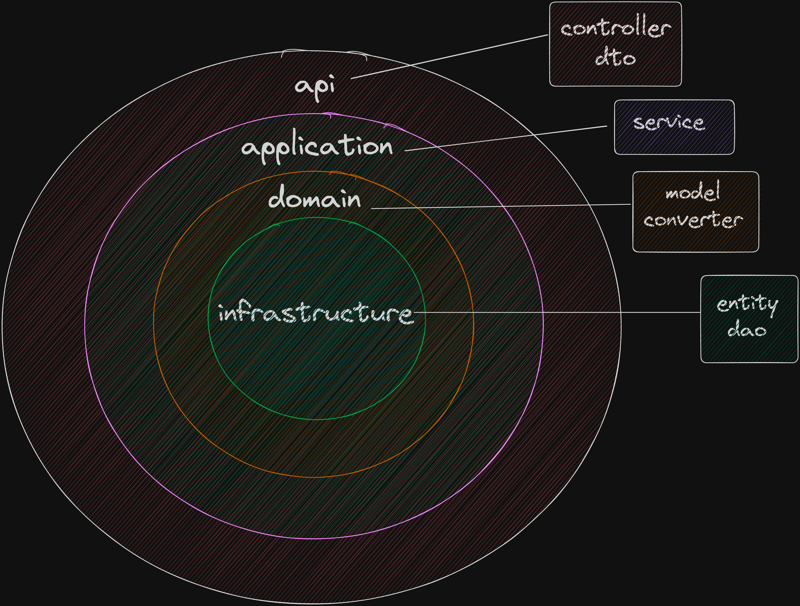

# Shopping Cart Backend


## Contents
- [Installation](#installation)
- [Usage](#usage)
- [Architecture](#architecture)
- [Technologies](#technologies)

## Installation
### Prerequisites
- Java 17
- Maven 3.9.4

### Clone
Clone or download this repository to your local machine.
```shell
git clone 'https://github.com/DevelopmentHiring/UtkuSapaz.git'
```
Open the project in your IDE.

### Docker
You can run the project with Docker.
```shell
docker build -t shoppingcart .
```
```shell
docker run -p 8080:8080 shoppingcart
```

## Usage
### Endpoints
#### Action 1 - Add Product to Cart
```
POST http://localhost:8080/cart/add/item
```
Body 
```json
{ "itemId":123, "categoryId":3003, "sellerId":33, "price":2500, "quantity":2 }
```
#### Action 2 - Add VasItem to Item
```
POST http://localhost:8080/cart/add/vasitem
```
Body 
```json
{"itemId": 123, "vasItemId":2, "categoryId": 3242, "sellerId":5003, "price":5, "quantity":2}
```

#### Action 3 - Remove Item from Cart
```
DELETE http://localhost:8080/cart/remove/item
```
Body 
```json
{ "itemId":123 }
```

#### Action 4 - Reset Cart
```
DELETE http://localhost:8080/cart/reset
```

#### Action 5 - Display Cart
```
GET http://localhost:8080/cart
```

## Architecture
Used DDD Clean Architecture. 



## Technologies
- Java 17
- Spring Boot 3.5.1
- Spring Data JPA
- H2 Database
- Docker
